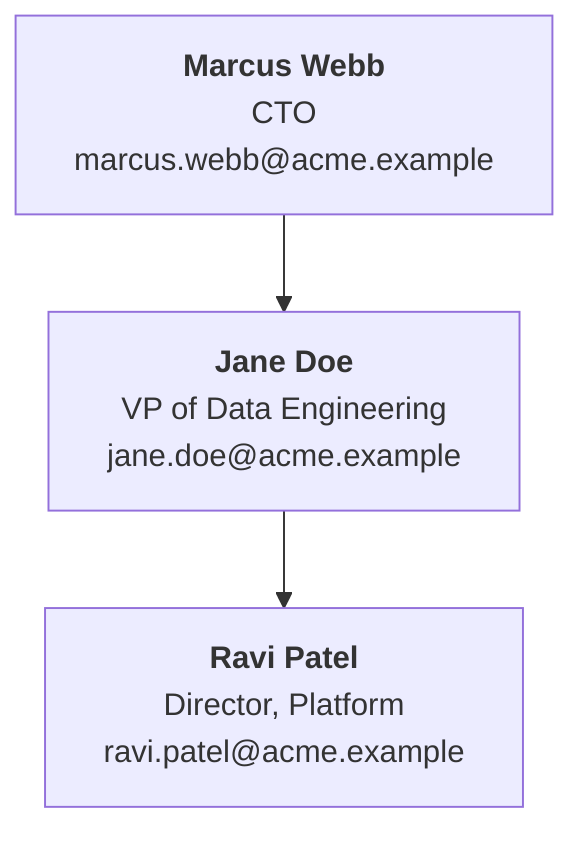

# Org Charts & Relationships

The shared model for tracking **people** in the vault. It is identical for our own company, for
partners, and for customers — the differences are small enough to fit in a table at the end.
Read this before creating or updating an org chart, a relationship page, or a person's entry
anywhere.

The base skill (`nerdynik-obsidian-vault-organization`) states *where* each context puts its
`Organization/` folder and carries the per-context exceptions. This file states *what goes in it*
and *how the charts are produced*.

## Everything about an organization's people lives in `Organization/`

One folder per organization, same shape every time:

```
Organization/
  Org Chart.md              # narrative + the Mermaid chart + per-person entries
  Org Chart.drawio          # source of truth for the visual chart (mxGraphModel XML)
  Org Chart.drawio.svg      # rendered export, embeddable in any note
  Contact Information.md    # only once Org Chart.md is split — see "Splitting"
  Relationships/
    <Person Name>.md        # one file per person who earns one
```

This holds for `Customers/<Customer>/Organization/`, `Partners/<Partner>/Organization/`, and
`<Company Name>/Organization/` alike. Nothing about an org's own people sits outside it.

`Parties/` is **not** part of this. It lives under a customer and lists who is working *that
account* across all companies involved. It links into these files; it never restates them.

## The primary record rule

**A person has exactly one primary record.** Every other mention is a wikilink to it, carrying at
most the person's name and email. When someone changes role, phone number, or Slack handle,
exactly one file changes.

| Person is… | Primary record |
|---|---|
| Our own staff | `<Company Name>/Organization/Relationships/<Person>` |
| A partner rep | `Partners/<Partner>/Organization/Relationships/<Person>` |
| A customer contact we actually work with | `Customers/<Customer>/Organization/Relationships/<Person>` |
| Any other customer employee | Their entry in `Customers/<Customer>/Organization/Org Chart` — a heading link, `[[Org Chart#Their Name]]` |

The org chart entry is a perfectly good link target. Falling back to it is expected, not a gap —
don't create a relationship page purely to have something to link at.

## Who earns a relationship page

The gate is **direct involvement in the work**, not attendance and not seniority alone.

**Yes:**

- Anyone on a project team, on any side — ours, the customer's, a partner's
- A primary point of contact for an account or project, including a sponsor who actually steers
  scope, budget, or timeline
- Anyone within our own company who is important regardless of project work — executives, VPs,
  practice leads
- Anyone about whom there is something worth saying beyond contact details: history, preferences,
  escalation path, how they like to be worked with

**No:**

- People who only attend or listen in on meetings — observers, skip-levels sitting in, rotating
  stakeholders. They belong in the org chart entry and in meeting attendee lists, nothing more.
- Everyone else on the org chart. An org chart names a whole company; relationship pages cover the
  handful we actually work with.

Create the page when the person crosses the gate, not preemptively. A folder of empty stubs is
worse than no folder — it makes "no page" stop meaning anything.

When someone who only attended keeps reappearing across calls, that's a signal to promote them.
Raise it rather than deciding silently.

## What a relationship page holds

It must stand alone — someone reading only this file should be able to contact the person and know
why they matter.

- **Contact information** — Full Name, Title, Email, phone, office/region. Repeated here on
  purpose, even though the org chart has it; this is the record people actually open.
- **Quick links for discovering more** — LinkedIn, Teams profile or chat link, Slack member link,
  internal directory entry, customer-side portal profile. These rot; note when they were checked.
- **Role and expertise** — practice affiliation, areas of depth, certifications where relevant.
- **Engagements** — wikilinks to every `Customers/<Customer>/` and project they touch, with their
  role on each.
- **Working notes** — relationship history, preferences, communication style, escalation path,
  sensitivities. This is the part no org chart can carry and the reason the file exists.

Keep everything that isn't contact information under headings, so other notes can block-link into
a specific piece rather than the whole page.

## The org chart, three ways

The same structure is maintained in three artifacts. They are **generated from one set of facts**,
so they can never be allowed to disagree.

| Artifact | Audience | Shows per person |
|---|---|---|
| `Org Chart.md` — per-person entries | The record of truth for the data | Everything known |
| `Org Chart.md` — Mermaid chart | Reading inside Obsidian | Full Name, Title, Email + link out |
| `Org Chart.drawio` / `.drawio.svg` | Sharing, printing, presenting | The same, plus their projects |

The per-person entries in `Org Chart.md` are authoritative. Both charts are renderings of them.
**Never edit a chart without updating the entries, and never update the entries without
regenerating both charts** — a chart that has drifted from the entries is worse than no chart,
because it looks current.

### Per-person entry format

One heading per person so `[[Org Chart#Full Name]]` resolves:

```markdown
### Jane Doe
- **Title:** VP of Data Engineering
- **Email:** jane.doe@acme.example
- **Phone:** +1 555 0100
- **Reports to:** [[Org Chart#Marcus Webb]]
- **Projects:** [[Lakehouse Migration]], [[Streaming Pilot]]
- **Relationship page:** [[Jane Doe]]
```

Omit `Relationship page` when there isn't one. Omit `Projects` for people not on any.

Full Name, Title, and Email are **mandatory on every person** — they are what both charts render.
If Email genuinely isn't known, write `unknown` rather than dropping the field, so the gap is
visible instead of looking like an oversight.

## The Mermaid chart

Goes inside `Org Chart.md`, in a `mermaid` code block, directly under a `## Chart` heading. It
replaces any hand-drawn ASCII/indented-text chart — delete that when converting, don't keep both.

**The syntax and validation rules live in [[nerdynik-mermaid-diagrams]]** — quoting, escaping,
`flowchart` over `graph`, theming, and rendering with `generate_mermaid_diagram` before writing
anything into the vault. Follow them; what's below is only the org-chart shape.

````markdown
## Chart


````

Rules:

- **Node id** is the person's name lowercased with underscores (`jane_doe`). Stable ids mean a
  regenerated chart diffs cleanly instead of reshuffling every line.
- **Label is always exactly three lines** — Full Name (bold), Title, Email — joined with `<br>`.
  Nothing else. The whole point of linking out is that the chart stays readable; resist adding
  phone numbers, projects, or tenure to it.
- **`click` only for people who have a relationship page.** Everyone else renders as a plain node;
  their detail is one heading away in the same file anyway.
- Job titles are the reason the escaping rules matter here — "VP, Sales & Marketing" contains both
  a comma and an ampersand. Quote and escape every label, always.

### Why `click` and not `class … internal-link`

Obsidian's native `class <id> internal-link` resolves the link from the node's **label text**,
which must then equal the note name exactly. That is incompatible with a label carrying Title and
Email, so it can't be used here. `click` with an `obsidian://open` URI accepts any label.

The cost of `click` is real and must be paid for explicitly:

- The vault name is baked into every URI. Record which vault name was used at the top of the file,
  and treat a vault rename as a regeneration trigger.
- URL-encode the path: spaces → `%20`, `/` → `%2F`.
- **Mermaid links do not register as Obsidian links.** They never appear in Outgoing Links,
  backlinks, or graph view.

Because of that last point, every Mermaid chart is followed by a **plain wikilink index** — the
only thing keeping these people connected to the rest of the vault's link graph:

```markdown
### People
[[Jane Doe]] · [[Ravi Patel]] · [[Marcus Webb]]
```

This isn't redundant with the chart. Drop it and the relationship pages silently become orphans.

### Validating before writing

Render with `generate_mermaid_diagram` before the chart goes into the vault — **every time**, not
just the first. Most breakage arrives later, with a new hire whose title contains an ampersand.
Pass `theme` and `backgroundColor` per **Branding** below.

## The DrawIO chart

`Org Chart.drawio` is the source of truth for the visual chart; `Org Chart.drawio.svg` is its
rendered export, and the one notes embed:

```markdown
![[Org Chart.drawio.svg]]
```

Keep both. The `.drawio` is XML that diffs cleanly and reopens for editing; the `.drawio.svg` is
what actually renders in a vault without a draw.io plugin installed, and what gets pasted into a
deck. Exported with `-e` it carries the diagram XML inside it, so it stays editable too — but it's
a generated artifact, not the thing you edit. Regenerate it in the same pass that changes the
`.drawio`; a stale export is the most likely way these artifacts drift apart.

**The mechanics live in [[nerdynik-drawio-diagrams]]** — which tool can write a file versus only
preview, the mxGraphModel format and its silent failure modes, ELK layout presets, the export
command, page-level editing, and locating the desktop CLI. Read it before generating a chart. What
follows is only what's specific to an org chart in this vault.

### The four decisions that are ours

1. **Layout is `verticalTree`.** It's the preset built for hierarchies; never hand-place an org
   chart's coordinates. Use `horizontalTree` for a wide, shallow org.
2. **Never delete the source `.drawio` after exporting.** draw.io's own pipeline does, because the
   export embeds the XML. We keep it, because the plain XML is what diffs in git.
3. **One `<diagram>` page per division** once the chart is split, named to match the heading in
   `Org Chart.md`, plus a top-level page of just the unit leads. This is what makes `set_page`
   worth using — one division's reorg touches one page.
4. **No `search_shapes`.** Org charts are rectangles and lines; the shape libraries have nothing
   to add and the call is wasted.

### No desktop CLI, no SVG

Layout and export both require draw.io Desktop. Without it you can still write a correct
`Org Chart.drawio` with hand-placed coordinates, but the `.drawio.svg` **cannot be produced at
all**. Write the `.drawio`, tell the user the export is outstanding, and don't embed a file that
isn't there.

### Node content

Each person is one node carrying **Full Name, Title, Email, and the projects they're involved in**
— the projects are what the DrawIO version adds over the Mermaid one, and the reason it exists.

```xml
<UserObject id="jane_doe"
            label="&lt;b&gt;Jane Doe&lt;/b&gt;&lt;br&gt;VP of Data Engineering&lt;br&gt;jane.doe@acme.example&lt;hr&gt;&lt;i&gt;Lakehouse Migration, Streaming Pilot&lt;/i&gt;"
            link="obsidian://open?vault=MyVault&amp;file=Customers%2FAcme%20Corp%2FOrganization%2FRelationships%2FJane%20Doe">
  <mxCell style="rounded=1;html=1;whiteSpace=wrap;fillColor=#FFFFFF;strokeColor=#1F3A5F;fontColor=#1F3A5F;"
          vertex="1" parent="1">
    <mxGeometry width="260" height="110" as="geometry" />
  </mxCell>
</UserObject>
```

- **Reuse the Mermaid node ids** (`jane_doe`) as cell ids. The two charts then line up
  person-for-person, and a diff on either one is readable.
- `<UserObject>` carries the `link`; a bare `<mxCell>` can't. Use it for anyone with a relationship
  page, a plain `<mxCell>` for everyone else.
- The `link` is the same `obsidian://open` URI as the Mermaid chart's `click` — same vault name,
  same URL-encoding.
- Projects go after an `&lt;hr&gt;` so they read as a separate band. Project names only — no roles,
  no dates. Omit the rule and the line entirely for people on no projects.
- Set `width` and `height`, **leave `x` and `y` off** — `verticalTree` assigns them. Include
  coordinates only in the no-CLI fallback.

### Bootstrapping a new chart

The Mermaid chart in `Org Chart.md` converts straight to draw.io and comes out laid out. Good for
standing up a first chart — but it carries neither the projects nor the branding, so it's a
starting point that still needs the node work above, not a finished chart.

draw.io's CSV importer also maps almost one-to-one onto the per-person entries and is a fast way to
get a large org in front of someone. It opens in the editor rather than producing a file, so it's a
sanity check, not the maintained pipeline.


## Branding

Charts produced from the vault are frequently shown outside it, so they follow **our own company's
branding** — the company maintaining this data — regardless of whose org chart is being drawn.

Look for it in `<Company Name>/Branding/`: color palette with hex values, typography, logo assets,
and any rules on how diagrams should look. Check it before generating either chart; if the folder
doesn't exist or has no palette, use draw.io and Mermaid defaults and **say that branding wasn't
found** rather than inventing a palette.

Apply it as:

- **Mermaid** — `backgroundColor` set to the brand background, and the closest `theme` of
  `default`, `base`, `forest`, `dark`, `neutral`. `base` is the one that takes customization; the
  others largely ignore it.
- **DrawIO** — brand colors in each cell's `fillColor`, `strokeColor`, and `fontColor`, and the
  brand typeface via `fontFamily`. This is where branding actually lands well, since the file is
  fully under our control.

A partner's or customer's own branding — `Partners/<Partner>/Branding/` — is for **co-branded or
externally delivered material only**. An internal org chart of a customer's staff is ours, drawn
in our colors. When a chart is going *to* the customer or partner, ask which applies rather than
assuming.

## Splitting a large chart

Once `Org Chart.md` passes roughly **500 lines**, split it rather than letting it grow:

- `Org Chart.md` keeps the reporting structure, the Mermaid chart, and the wikilink index.
- `Contact Information.md` takes the per-person entries — one heading per person, so heading links
  still resolve. They now resolve against **`Contact Information`**, not `Org Chart`; update the
  existing links, and note the change at the top of both files.

Split proactively as the file approaches the threshold, not once it's unwieldy.

For the charts themselves, a diagram stops being readable well before 500 lines of source does.
Past roughly **40 people**, split by division or reporting line: one Mermaid chart per unit under
its own heading, one `<diagram>` page per unit in the `.drawio` (see "Splitting across pages"),
and a top-level chart showing only the unit leads with links down into each. Don't render a
hundred-node flowchart and call it done — nobody can read it, so nobody will notice when it's
wrong.

## Keeping the three in sync

Any change to a person — new hire, departure, title change, reporting line, project assignment —
is one unit of work across all of it:

1. Update the per-person entry in `Org Chart.md` (or `Contact Information.md` once split).
2. Regenerate the Mermaid chart and the wikilink index; validate it with
   `generate_mermaid_diagram`.
3. Patch the affected page of `Org Chart.drawio` with `set_page`, re-run `--layout verticalTree`,
   and re-export `Org Chart.drawio.svg`. All three steps or none — a laid-out file with a stale
   export is the same failure as no update at all.
4. Update their relationship page if they have one, including their engagements list.
5. Follow the reciprocal links out — `Parties/Account Team.md`, per-project team files — and fix
   what the change invalidates.

**Departures are deletions of nothing.** Mark the person as departed with a date in their entry
and remove them from the charts; don't delete the entry or the relationship page. The history of
who was in the seat is most of why the record was worth keeping.

## Per-context differences

Everything above is common. These are the only variations:

| | `<Company Name>/Organization/` | `Partners/<Partner>/Organization/` | `Customers/<Customer>/Organization/` |
|---|---|---|---|
| Who's charted | Our own staff | The partner's people we deal with | The customer's org, as far as we know it |
| Gets a relationship page | Project-attached staff, plus execs and practice leads regardless of project work | Reps on an account team, or anyone with more than contact details to record | **Primary contacts and people directly involved in the work only** — not meeting attendees or observers |
| Projects on the DrawIO nodes | Our projects across all customers | Customer accounts they touch | This customer's projects they're involved in |
| Relationship page links out to | Every customer and project they're engaged on | Every customer account they touch | Their own projects, and the account team entry |
| Completeness expected | Complete | Only the parts we interact with | Partial by nature — say what's unconfirmed |
| Branding | Ours | Ours, unless co-branded | Ours, unless the chart is being sent to the customer |

A customer org chart is the one most likely to be wrong, because it's assembled from meetings and
signature blocks rather than an HR system. Mark inferred reporting lines as inferred. A confidently
drawn wrong hierarchy gets repeated in front of the customer.

## Anti-patterns

- **Contact details copied into an account team or project file.** Name and email, then a wikilink.
  Every copy ages independently and at least one of them is already wrong.
- **A chart edited without its entries.** The entries are the data; charts are output.
- **A relationship page for everyone on the org chart.** The gate is involvement in the work.
- **A `.drawio.svg` embedded but never regenerated.** Re-export in the same pass, every time.
- **An ASCII or indented-text org chart left in place beside the Mermaid one.** Two charts means
  one of them is stale. Delete the old one on conversion.
- **A Mermaid chart with no wikilink index under it.** Those people are now orphans in the graph.
